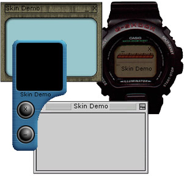



## SkinDemo \- Updated\!\!

### Description

Updates and fixes 11/11/00: 

 I have updated the example a bit. I updated the move for (thanks to Joey Burgett). I fixed the code in the OpenSkin sub, now if the user is a first time user it will load the default skin! 

Because of a request i also made it so that the form can be in the Windows task bar!  

I also updated the SkinBuilder, now you can make the exit and minimize buttons show or hide its captions and i added a new feature that allows you to preview the skin in a form so that you know what the skin will look like (this is why the skinbuilder source is now in the "skin" directory)  

And i also made 4 new Skins (Some graphics are from SoftShape, view skin comments for more)!!

 

----

 

Hello VB'ers. This code allows you to custumize (skin) your project 100% (size, shape, etc)

It also comes with a skin builder and 4 skins. It can save the last used skin, move the position of object and much more! Check it out, very easy to edit and understant, totally commented. please vote!

Thanks

Matt!!
 
### More Info
 

             |
---                |---
**Submitted On**   |2000-11-11 16:29:06
**By**             |[Matthew Woodhams](https://github.com/Planet-Source-Code/PSCIndex/blob/master/ByAuthor/matthew-woodhams.md)
**Level**          |Intermediate
**User Rating**    |4.8 (260 globes from 54 users)
**Compatibility**  |VB 5\.0, VB 6\.0
**Category**       |[Custom Controls/ Forms/  Menus](https://github.com/Planet-Source-Code/PSCIndex/blob/master/ByCategory/custom-controls-forms-menus__1-4.md)
**World**          |[Visual Basic](https://github.com/Planet-Source-Code/PSCIndex/blob/master/ByWorld/visual-basic.md)
**Archive File**   |[CODE\_UPLOAD1158911112000\.zip](https://github.com/Planet-Source-Code/matthew-woodhams-skindemo-updated__1-12511/archive/master.zip)

